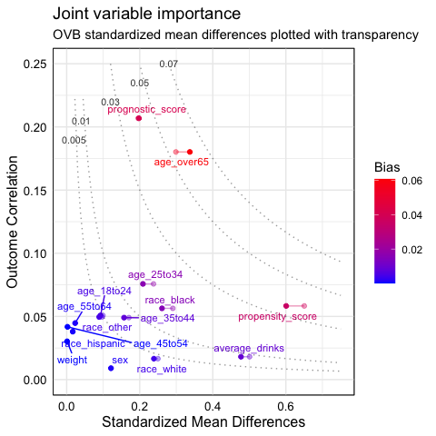

<!-- README.md is generated from README.Rmd. Please edit that file -->

# Joint variable importance plot

<!-- badges: start -->

<!-- badges: end -->

Joint variable importance plot (jointVIP) visualizes each variable’s
outcome importance via Pearson’s correlation and treatment importance
via standardized mean differences. Bias curves enable comparisons to
support priotization.

## Installation

You can install the released version of jointVIP with:

``` r
install.packages("jointVIP")
```

## BRFSS Example

To demonstrate, we use the 2015 Behavioral Risk Factor Surveillance
System (BRFSS) example to answer the causal question: Does smoking
increase the risk of chronic obstructive pulmonary disease (COPD)? The
data and background is inspired by [Clay Ford’s work from University of
Virginia
Library](https://data.library.virginia.edu/getting-started-with-matching-methods/).
First, the data is cleaned to only have numeric variables,
i.e. dichodimize all factored variables. Treatment variable only
contains 0 (control) and 1 (treatment).

With the cleaned data, you can specify details in the function
`plot_jointVIP` like so:

``` r
library(jointVIP)

treatment = 'smoke'
outcome = 'COPD'
covariates = names(df)[!names(df) %in% c(treatment, outcome)]

## select the pilot sample from random portion
set.seed(123485)
pilot_prop = 0.2
pilot_sample_num = sample(which(df %>% pull(treatment) == 0),
                          length(which(df %>% pull(treatment) == 0)) *
                            pilot_prop)

## set up pilot and analysis data
pilot_df = df[pilot_sample_num, ]
analysis_df = df[-pilot_sample_num, ]

## minimal example
brfss_vip = plot_jointVIP(pilot_df = pilot_df,
                          analysis_df = analysis_df,
                          treatment = treatment,
                          covariates = covariates,
                          outcome = outcome,
                          use_abs = T)

## not run
## obtain summary measures
# brfss_vip$measures
## show the joint variable importance plot
brfss_vip$VIP
```


