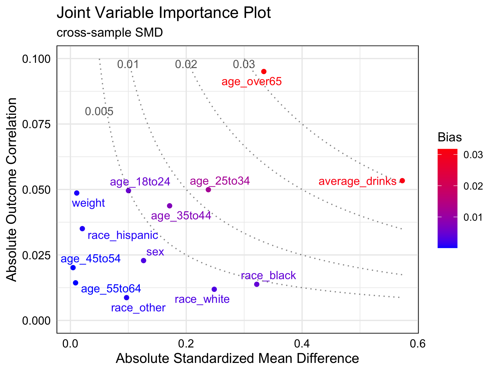

<!-- README.md is generated from README.Rmd. Please edit that file -->

# Joint variable importance plot 

<!-- badges: start -->

[](https://cran.r-project.org/package=jointVIP)
[](https://cran.r-project.org/package=jointVIP)
<!-- badges: end -->

Joint variable importance plot (jointVIP) visualizes each variable’s
outcome importance via Pearson’s correlation and treatment importance
via cross-sample standardized mean differences. Bias curves enable
comparisons to support prioritization.

## Installation

You can install the `jointVIP` package on CRAN using:

``` r
# for version on CRAN
install.packages("jointVIP")

# for development version on github
devtools::install_github("ldliao/jointVIP")
```

## BRFSS Example

To demonstrate, we use the 2015 Behavioral Risk Factor Surveillance
System (BRFSS) example to answer the causal question: Does smoking
increase the risk of chronic obstructive pulmonary disease (COPD)? The
data and background is inspired by [Clay Ford’s work from University of
Virginia
Library](https://data.library.virginia.edu/getting-started-with-matching-methods/).
First, the data is cleaned to only have numeric variables, i.e., all
factored variables are transformed via one-hot-encoding. Treatment
variable `smoke` only contains 0 (control) and 1 (treatment).

With the cleaned data, you can specify details in the function
`create_jointVIP()` like so:

``` r
library(jointVIP)
## basic example code

treatment = 'smoke'
outcome = 'COPD'
covariates = names(df)[!names(df) %in% c(treatment, outcome)]

## select the pilot sample from random portion
## pilot data here are considered as 'external controls'
## can be a separate dataset; should be chosen with caution
set.seed(1234895)
pilot_prop = 0.2
pilot_sample_num = sample(which(df %>% pull(treatment) == 0),
                          length(which(df %>% pull(treatment) == 0)) *
                          pilot_prop)

## set up pilot and analysis data
## we want to make sure these two data are non-overlapping
pilot_df = df[pilot_sample_num, ]
analysis_df = df[-pilot_sample_num, ]

## minimal example
brfss_jointVIP = create_jointVIP(treatment = treatment,
                                 outcome = outcome,
                                 covariates = covariates,
                                 pilot_df = pilot_df,
                                 analysis_df = analysis_df)
```

Generic functions can be used for the `jointVIP` object to extract
information as a glance with `summary()` and `print()`.

``` r
summary(brfss_jointVIP)
#> Max absolute bias is 0.032
#> 3 variables are above the desired 0.01 absolute bias tolerance
#> 13 variables can be plotted
print(brfss_jointVIP)
#>                 bias
#> age_over65     0.032
#> average_drinks 0.031
#> age_25to34     0.012
```

``` r
plot(brfss_jointVIP)
```



In this example, `age_over65` and `average_drinks` are two most
important variables to adjust. At a bias tolerance of 0.01, 3 variables:
`age_over65`, `average_drinks`, and `age_25to34` are above the tolerance
threshold. Moreover, `age_over65` and `average_drinks` are of higher
importance for adjustment than `age_25to34`. Although `race_black` and
`age_over65` have similar absolute standardized mean differences (0.322
and 0.333, respectively), `age_over65` is more important to adjust for
since its highly correlated with the outcome.
